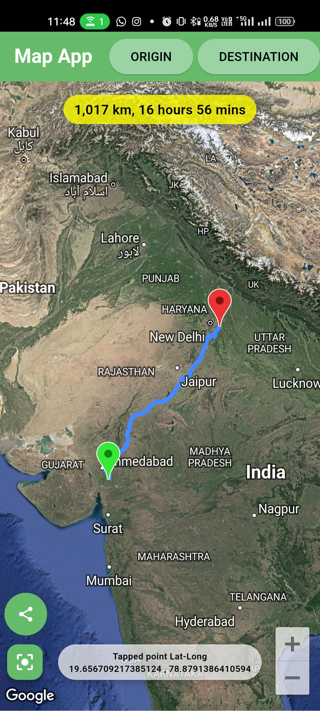
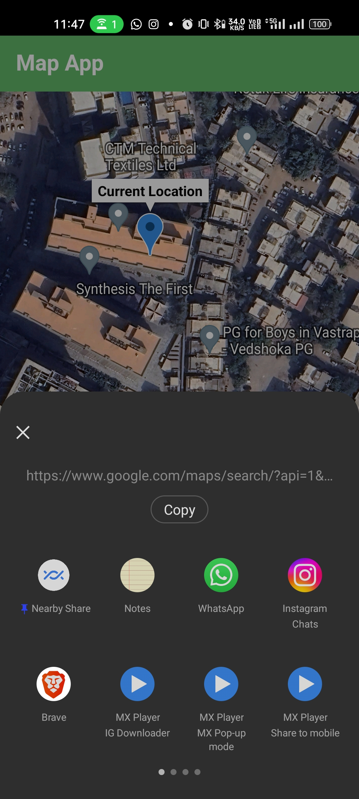
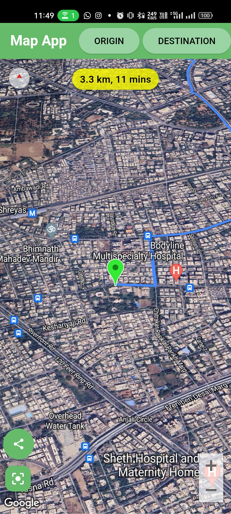
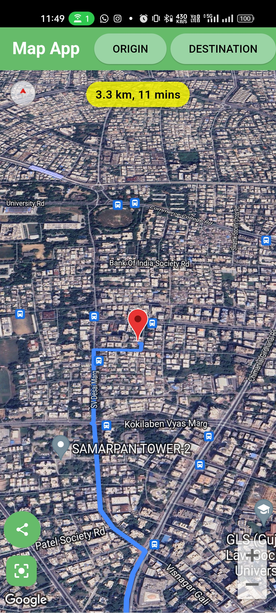

<h1 align="center">Flutter Map App</h1>

  A Flutter application for exploring maps, setting routes, and fetching directions using Google Maps API.

  
  
  
  

## Features

- 🗺️ Explore Google Maps with ease.
- 📍 Set origin and destination markers effortlessly - just long press to add marker.
- 🚗 Fetch and visualize directions between chosen points.
- 📍 Get Current Location and share with others.
- 📏 View real-time information about the total distance and estimated duration of your route.
- 📍 Get Latitude-Longitude of tapped point.

## Dependencies
- Dio: For making HTTP requests.
- Google Maps Flutter: For integrating Google Maps.
